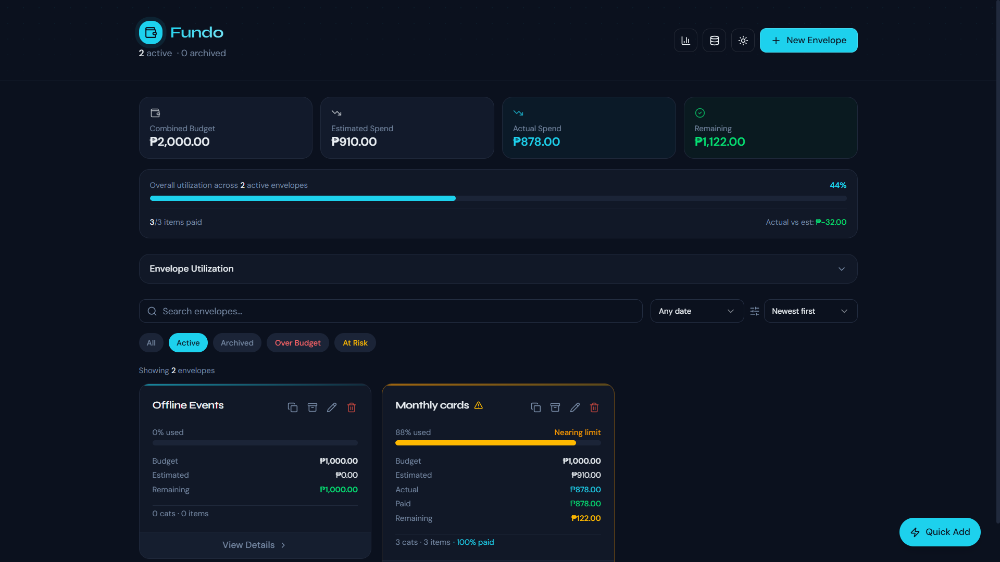
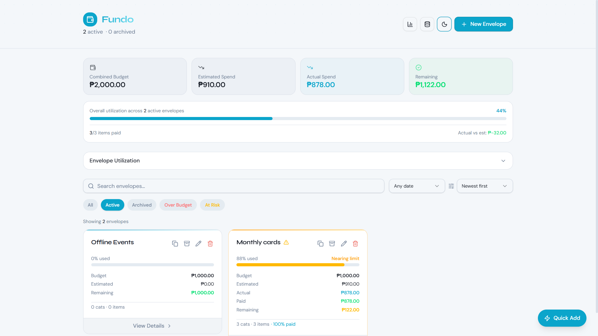
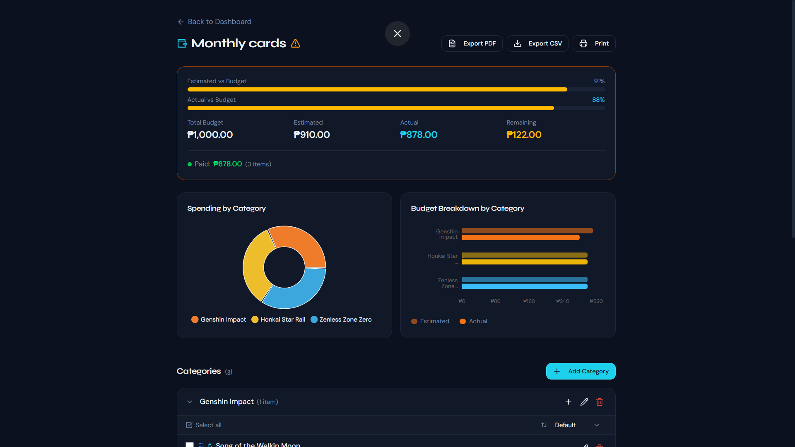
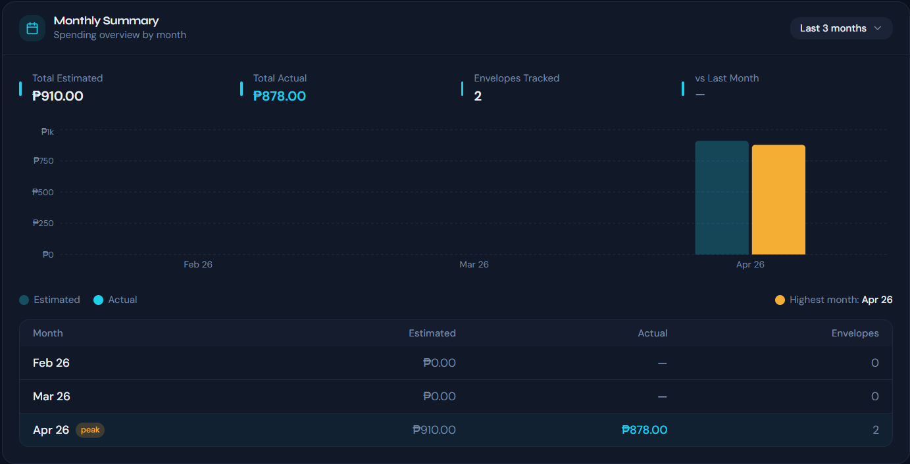
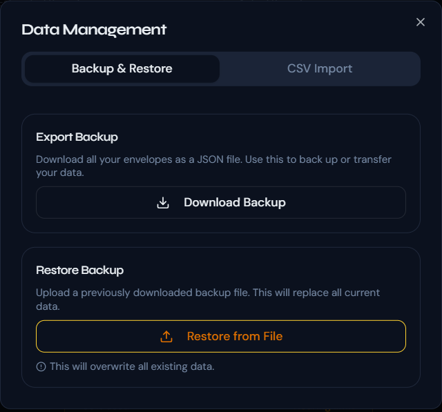

  # Fundo — Envelope Expense Tracker

> A personal expense tracking web app built around the **envelope budgeting method** — organize your spending into envelopes, track estimates vs actuals, and stay on top of recurring expenses.

**Status:** Actively improving

---

## Features

### Dashboard
- **Summary Cards** — at-a-glance view of Combined Budget, Estimated Spend, Actual Spend, and Remaining balance
- **Overall Utilization Bar** — visual progress of spending across all active envelopes with paid item count
- **Envelope Utilization Chart** — expandable bar chart comparing Budget vs Spend per envelope
- **Monthly Summary** — spending overview by month with bar chart, peak month highlight, and a detailed breakdown table
- **Search, Filter & Sort** — search envelopes by name, filter by status (Active, Archived, Over Budget, At Risk), and sort by newest or oldest

### Envelopes
- Create envelopes with a name, total budget, event date, notes/memo, tags, and a configurable **budget warning threshold** (default 80%)
- Each envelope shows usage percentage, budget, estimated, actual, paid, and remaining amounts
- Status indicators: **Nearing Limit**, **Over Budget**, **At Risk**
- Duplicate, archive, edit, and delete envelopes

### Envelope Detail View
- **Spending by Category** — interactive donut chart with hover tooltips
- **Budget Breakdown by Category** — horizontal bar chart comparing estimated vs actual per category
- **Export options** — Export PDF, Export CSV, and Print
- **Categories** — add, edit, and delete spending categories within each envelope
- **Items** — add items with name, quantity, estimated price, actual price, vendor/supplier, due date, status (Unordered/Paid), priority, receipt reference, notes, and **recurring item toggle** (auto-resets on the 1st of each month)
- **Partial Payments** — log partial payment amounts with date and note
- **Activity Log** — full history of all events within the envelope

### Data Management
- **Backup & Restore** — export all envelopes as a JSON file and restore from a backup
- **CSV Import** — import expense data from CSV

### Quick Add
- Floating **Quick Add** widget for fast item entry without navigating to an envelope

### Theme
- **Dark / Light mode** toggle

---

## Tech Stack

| Category | Technologies |
|---|---|
| Frontend | React, JSX, Tailwind CSS |
| Build Tool | Vite |
| Language | JavaScript |
| Charts | Recharts |
| Data Storage | localStorage |

---

## Screenshots

### Dashboard — Dark Mode


### Dashboard — Light Mode


### Envelope Detail with Charts


### Monthly Summary


### Data Management


---

## Getting Started

```bash
# Clone the repository
git clone https://github.com/jarquecarl-debug/fundo-expense-tracking-app.git

# Navigate to the project directory
cd fundo-expense-tracking-app

# Install dependencies
npm install

# Start the development server
npm run dev
```

Open `http://localhost:5173` in your browser.

---

## Roadmap

- [x] Deploy to Netlify
- [ ] Cloud sync / user accounts
- [ ] Mobile app version
- [ ] Notification reminders for recurring items
- [ ] Multi-currency support

---

## Author

**Carl Christian Jarque**
Frontend Developer · Computer Engineering Graduate

- GitHub: [@jarquecarl-debug](https://github.com/jarquecarl-debug)
- LinkedIn: [carl-jarque](https://www.linkedin.com/in/carl-jarque-6b65b63bb/)
