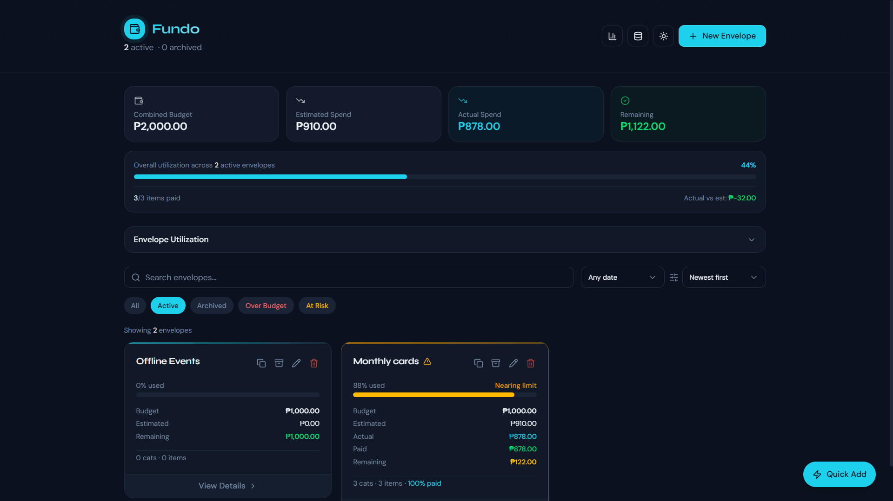
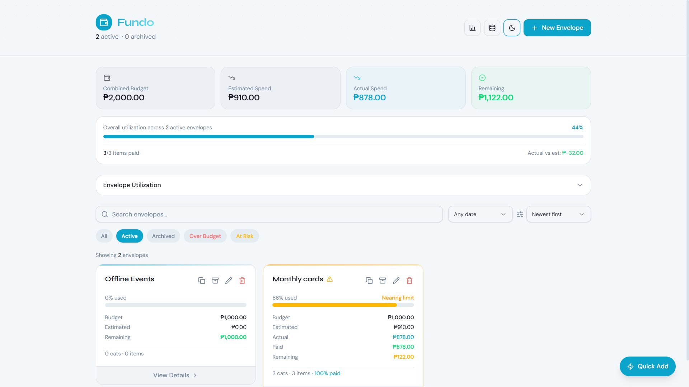
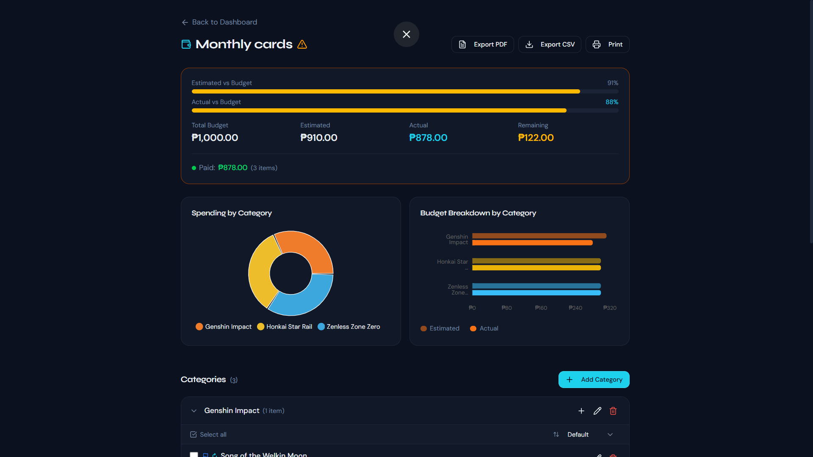
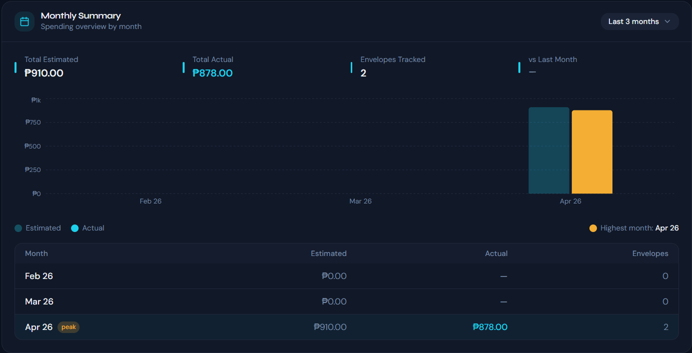

# 💸 Fundo — Envelope Expense Tracker

A personal expense tracking web app built around the **envelope budgeting method** — organize spending into envelopes, track estimates vs actuals, and stay on top of recurring expenses.

[](https://fundo-expense-tracking-app.netlify.app)


---

## Screenshots

| Dashboard — Dark Mode | Dashboard — Light Mode |
|---|---|
|  |  |

| Envelope Detail | Monthly Summary |
|---|---|
|  |  |

---

## Features

### Dashboard
- **Summary cards** — combined budget, estimated spend, actual spend, and remaining balance at a glance
- **Overall utilization bar** — visual spending progress across all active envelopes
- **Envelope utilization chart** — expandable bar chart comparing budget vs spend per envelope
- **Monthly summary** — spending by month with bar chart, peak month highlight, and detailed breakdown table
- **Search, filter & sort** — search by name, filter by status (Active, Archived, Over Budget, At Risk), sort by newest or oldest

### Envelopes
- Create envelopes with name, total budget, event date, notes, tags, and a configurable **budget warning threshold**
- Per-envelope status indicators: **Nearing Limit**, **Over Budget**, **At Risk**
- Duplicate, archive, edit, and delete envelopes

### Envelope Detail
- **Spending by category** — interactive donut chart with hover tooltips
- **Budget breakdown by category** — horizontal bar chart comparing estimated vs actual
- **Export options** — PDF, CSV, and Print
- **Items** — name, quantity, estimated/actual price, vendor, due date, status (Unordered/Paid), priority, receipt reference, notes, and **recurring item toggle** (auto-resets on the 1st of each month)
- **Partial payments** — log partial amounts with date and note
- **Activity log** — full history of all events within an envelope

### Data Management
- **Backup & restore** — export all envelopes as JSON, restore from backup
- **CSV import** — import expense data from CSV

### Other
- Floating **Quick Add** widget for fast item entry without navigating to a specific envelope
- **Dark / Light mode** toggle

---

## Tech Stack

| Category | Technology |
|---|---|
| Frontend | React · JSX · Tailwind CSS |
| Language | JavaScript |
| Charts | Recharts |
| Build Tool | Vite |
| Storage | localStorage |
| Deployment | Netlify |

---

## Getting Started

```bash
git clone https://github.com/jarquecarl/fundo-expense-tracking-app.git
cd fundo-expense-tracking-app
npm install
npm run dev
```

Open [http://localhost:5173](http://localhost:5173) in your browser.

---

## Roadmap

- [x] Deploy to Netlify
- [ ] Cloud sync / user accounts
- [ ] Mobile app version
- [ ] Notification reminders for recurring items
- [ ] Multi-currency support

---

> Built by [Carl Christian Jarque](https://carl-jarque-portfolio.netlify.app) · [LinkedIn](https://linkedin.com/in/carl-jarque-6b65b63bb)
